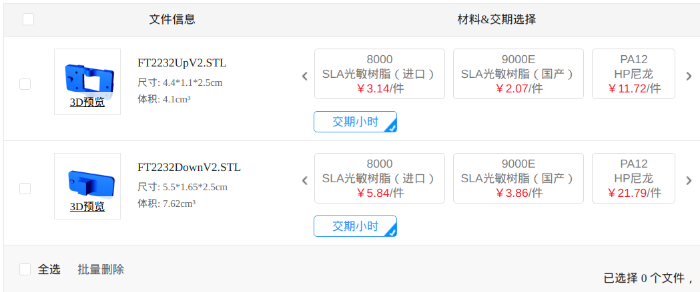
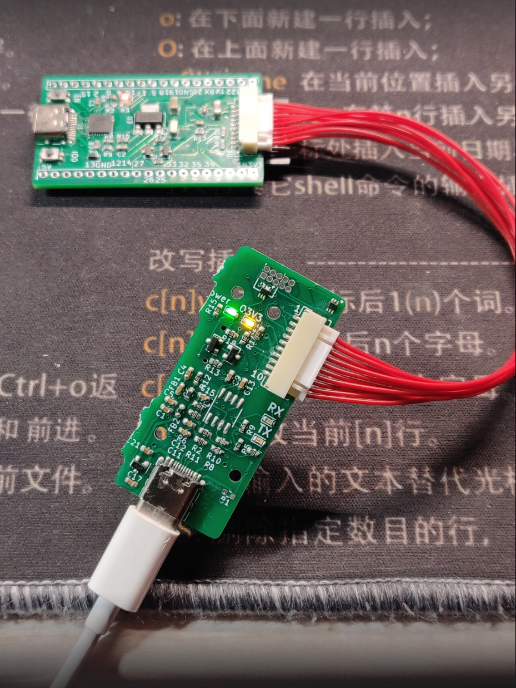
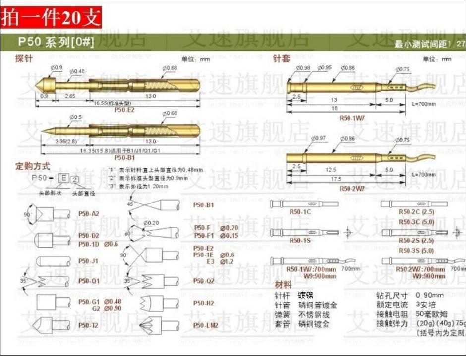
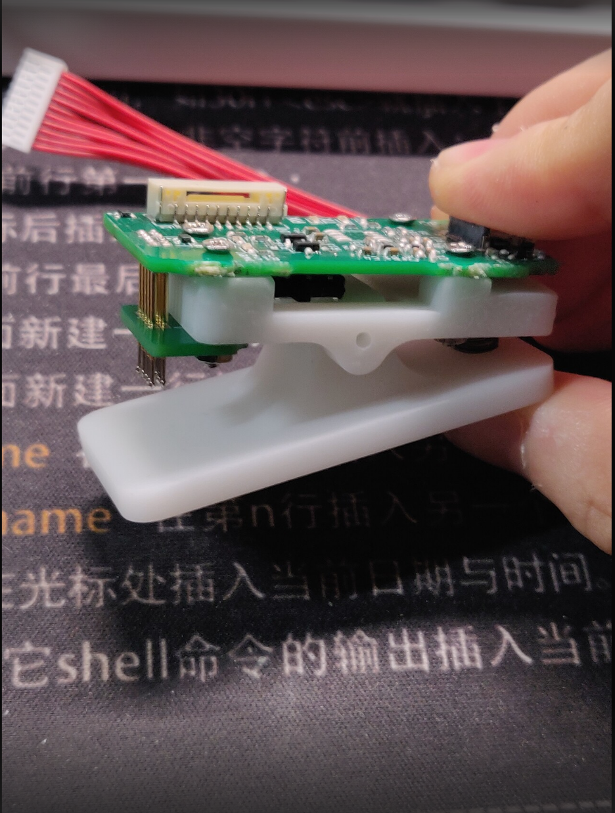
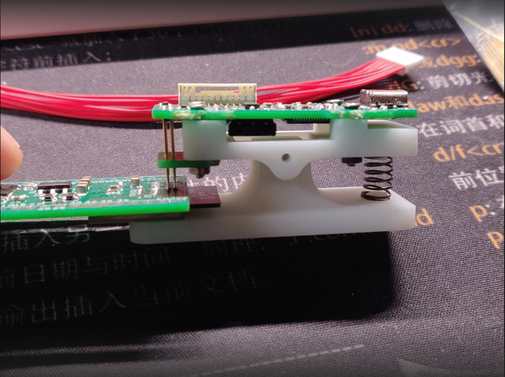

# ft2232h_esp32

How to use make this tool?

1. First, get your PCB.
2. Print the 3D part. STL and SolidWorks2016 files are available. You can go to sanweihou for 3D printing, the cost is incredibly low, Less than 2 dollars! If you decide not to print the 3D part, you can't use pins. However GH1.25 cables are still available as the photo shows 
3. Or, get the pins, under board, screws and put them together. When you are buying the pins, **be careful about their radius**. Double check if the PCB and the pins can fit in.
4. How it looks.

Last, please don't forget the ESDs(USBLC6-2P6). If you don't mount them, it is possible for you to break your ft2232 after some thousands times of connecting. Please Search Google for more info about why ESD is important.